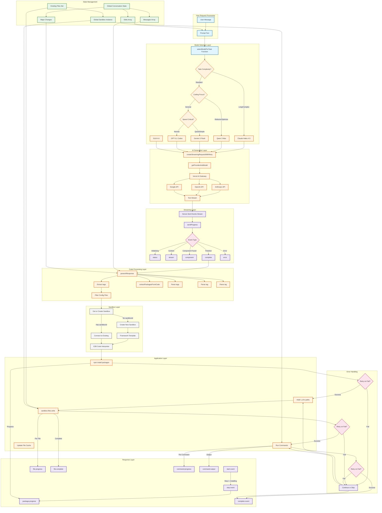
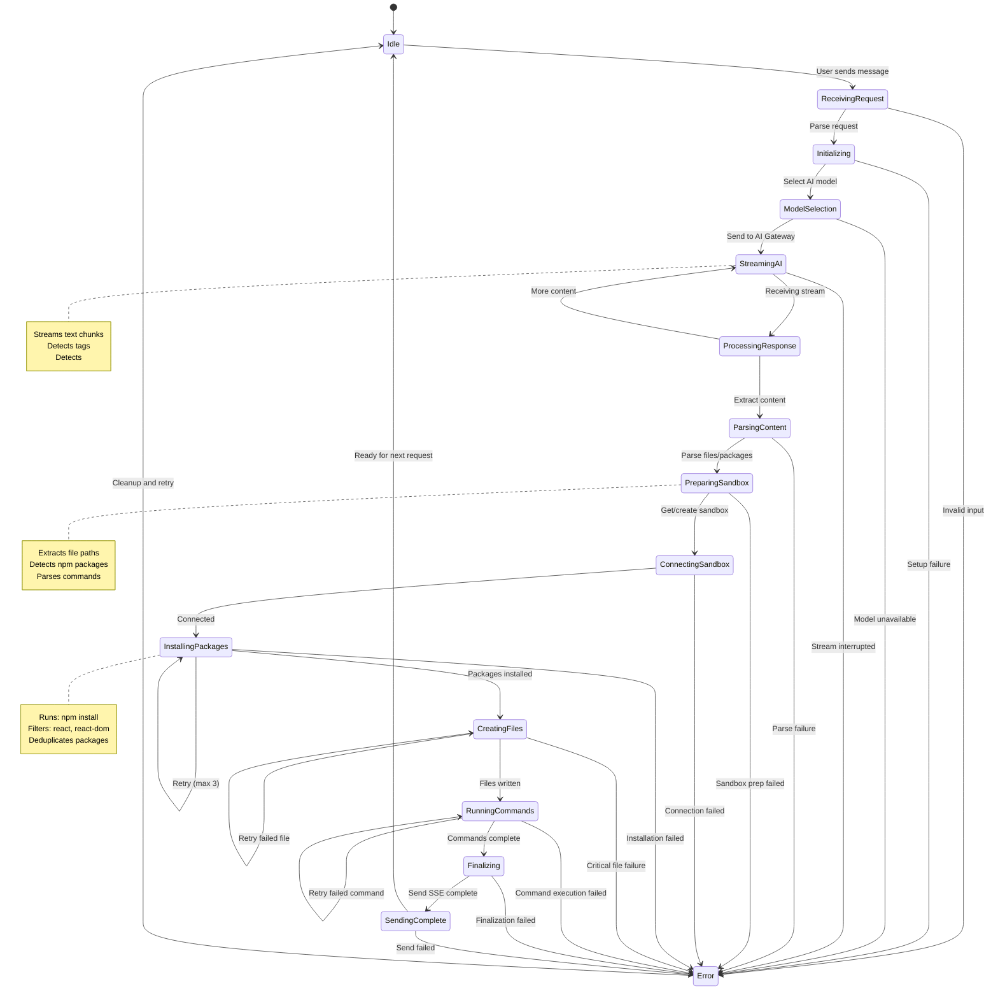
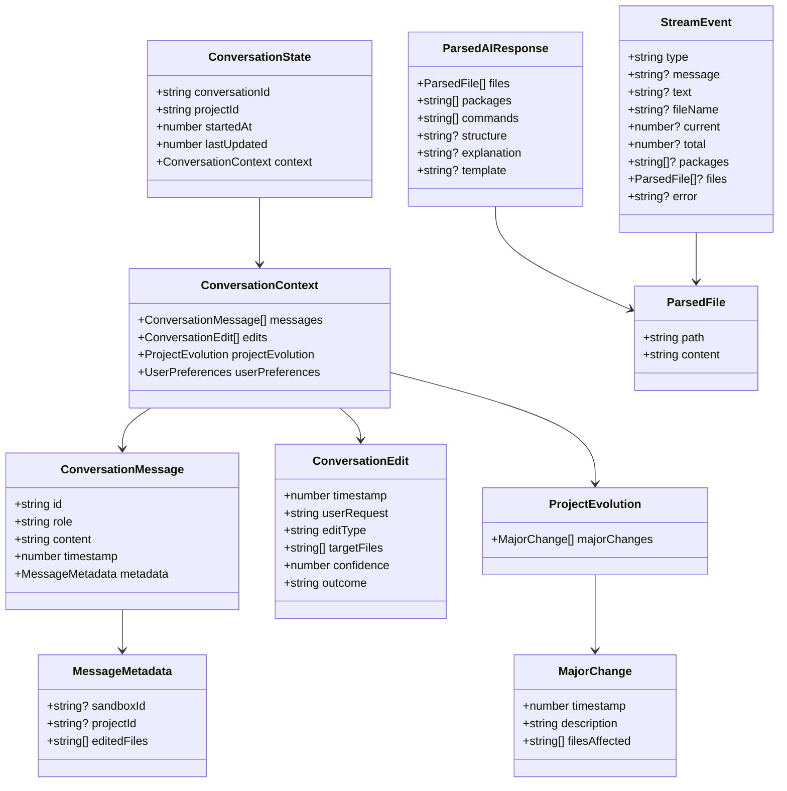

# AI Agent Workflow Diagram

```mermaid
flowchart TB
    subgraph "User Request Processing"
        UserMessage[User Message]
        Prompt[Prompt Text]
    end

    subgraph "Model Selection Layer"
        SelectModel[selectModelForTask Function]
        TaskComplexity{Task Complexity?}
        CodingFocus{Coding Focus?}
        SpeedCritical{Speed Critical?}
        Haiku[Claude Haiku 4.5]
        Qwen[Qwen 3 Max]
        Flash[Gemini 3 Flash]
        GPT[GPT-5.1 Codex]
        GLM[GLM 4.6]
    end

    subgraph "AI Generation Layer"
        AIRequest[createStreamingRequestWithRetry]
        ProviderSelection[getProviderAndModel]
        AIGateway[Vercel AI Gateway]
        ClaudeProvider[Anthropic API]
        OpenAIProvider[OpenAI API]
        GoogleProvider[Google API]
        ResponseStream[Text Stream]
    end

    subgraph "Streaming Layer"
        SSEStream[Server-Sent Events Stream]
        StreamProgress[sendProgress]
        StreamEvents{Event Type}
        StatusEvent[status]
        StreamEvent[stream]
        ComponentEvent[component]
        CompleteEvent[complete]
        ErrorEvent[error]
    end

    subgraph "Code Processing Layer"
        ParseResponse[parseAIResponse]
        FileExtraction[Extract <file> tags]
        PackageDetection[extractPackagesFromCode]
        CommandParsing[Parse <command> tags]
        StructureParsing[Parse <structure> tag]
        ExplanationParsing[Parse <explanation> tag]
        FilterConfig[Filter Config Files]
    end

    subgraph "Sandbox Layer"
        GetCreateSandbox[Get or Create Sandbox]
        ConnectExisting[Connect to Existing]
        CreateNew[Create New Sandbox]
        SandboxTemplate[Framework Template]
        E2B[E2B Code Interpreter]
    end

    subgraph "Application Layer"
        InstallPackages[npm install packages]
        CreateDirs[mkdir -p for paths]
        WriteFiles[sandbox.files.write]
        ExecuteCommands[Run Commands]
        UpdateCache[Update File Cache]
    end

    subgraph "Response Layer"
        SendStart[start event]
        SendStep[step event]
        SendFileProgress[file-progress]
        SendFileComplete[file-complete]
        SendPackageProgress[package-progress]
        SendCommandProgress[command-progress]
        SendCommandOutput[command-output]
        SendFinalComplete[complete event]
    end

    subgraph "Error Handling"
        PackageRetry{Retry on Fail?}
        FileRetry{Retry on Fail?}
        CommandRetry{Retry on Fail?}
        ErrorFallback[Continue or Skip]
    end

    subgraph "State Management"
        ConversationState[Global Conversation State]
        MessageHistory[Messages Array]
        EditHistory[Edits Array]
        ProjectEvolution[Major Changes]
        FileCache[Existing Files Set]
        ActiveSandbox[Global Sandbox Instance]
    end

    %% Flow connections
    UserMessage --> Prompt
    Prompt --> SelectModel

    SelectModel --> TaskComplexity
    TaskComplexity -->|Long/Complex| Haiku
    TaskComplexity -->|Standard| CodingFocus

    CodingFocus -->|Refactor/Optimize| Qwen
    CodingFocus -->|General| SpeedCritical

    SpeedCritical -->|Quick/Simple| Flash
    SpeedCritical -->|Normal| GPT

    %% AI Generation Flow
    Haiku --> AIRequest
    Qwen --> AIRequest
    Flash --> AIRequest
    GPT --> AIRequest
    GLM --> AIRequest

    AIRequest --> ProviderSelection
    ProviderSelection --> AIGateway

    AIGateway --> ClaudeProvider
    AIGateway --> OpenAIProvider
    AIGateway --> GoogleProvider

    ClaudeProvider --> ResponseStream
    OpenAIProvider --> ResponseStream
    GoogleProvider --> ResponseStream

    %% Streaming Flow
    ResponseStream --> SSEStream
    SSEStream --> StreamProgress
    StreamProgress --> StreamEvents

    StreamEvents -->|Initializing| StatusEvent
    StreamEvents -->|Content| StreamEvent
    StreamEvents -->|Component Found| ComponentEvent
    StreamEvents -->|Finished| CompleteEvent
    StreamEvents -->|Error| ErrorEvent

    %% Code Processing Flow
    CompleteEvent --> ParseResponse
    ParseResponse --> FileExtraction
    ParseResponse --> PackageDetection
    ParseResponse --> CommandParsing
    ParseResponse --> StructureParsing
    ParseResponse --> ExplanationParsing

    FileExtraction --> FilterConfig

    %% Sandbox Flow
    FilterConfig --> GetCreateSandbox
    GetCreateSandbox -->|Has sandboxId| ConnectExisting
    GetCreateSandbox -->|No sandboxId| CreateNew

    CreateNew --> SandboxTemplate
    SandboxTemplate --> E2B
    ConnectExisting --> E2B

    E2B --> InstallPackages

    %% Application Flow
    InstallPackages --> PackageRetry
    PackageRetry -->|Success| CreateDirs
    PackageRetry -->|Fail| ErrorFallback
    ErrorFallback --> CreateDirs

    CreateDirs --> WriteFiles
    WriteFiles --> FileRetry
    FileRetry -->|Success| ExecuteCommands
    FileRetry -->|Fail| ErrorFallback
    ErrorFallback --> ExecuteCommands

    ExecuteCommands --> CommandRetry
    CommandRetry -->|Success| SendFinalComplete
    CommandRetry -->|Fail| ErrorFallback
    ErrorFallback --> SendFinalComplete

    %% Response Events Flow
    SendStart -->|Step 1: Installing| SendStep
    SendStep --> SendPackageProgress

    InstallPackages -->|Progress| SendPackageProgress

    WriteFiles -->|Per File| SendFileProgress
    WriteFiles -->|Complete| SendFileComplete

    ExecuteCommands -->|Per Command| SendCommandProgress
    ExecuteCommands -->|Output| SendCommandOutput

    %% State Management
    ConversationState --> MessageHistory
    ConversationState --> EditHistory
    ConversationState --> ProjectEvolution
    MessageHistory --> Prompt
    EditHistory --> ParseResponse
    ProjectEvolution --> ParseResponse

    FileCache --> WriteFiles
    FileCache --> ActiveSandbox
    ActiveSandbox --> WriteFiles
    ActiveSandbox --> ExecuteCommands

    classDef input fill:#e1f5fe,stroke:#01579b,stroke-width:2px
    classDef process fill:#fff3e0,stroke:#e65100,stroke-width:2px
    classDef decision fill:#fce4ec,stroke:#c2185b,stroke-width:2px
    classDef storage fill:#e8f5e9,stroke:#2e7d32,stroke-width:2px
    classDef external fill:#f5f5f5,stroke:#616161,stroke-width:2px
    classDef stream fill:#ede7f6,stroke:#4527a0,stroke-width:2px

    class UserMessage,Prompt,SelectModel input
    class TaskComplexity,CodingFocus,SpeedCritical,Haiku,Qwen,Flash,GPT,GLM,AIRequest,ProviderSelection,AIGateway,ClaudeProvider,OpenAIProvider,GoogleProvider,ResponseStream,ParseResponse,FileExtraction,PackageDetection,CommandParsing,StructureParsing,ExplanationParsing,FilterConfig,InstallPackages,CreateDirs,WriteFiles,ExecuteCommands,UpdateCache process
    class StreamEvents,PackageRetry,FileRetry,CommandRetry decision
    class ConversationState,MessageHistory,EditHistory,ProjectEvolution,FileCache,ActiveSandbox storage
    class E2B,GetCreateSandbox,ConnectExisting,CreateNew,SandboxTemplate external
    class SSEStream,StreamProgress,StatusEvent,StreamEvent,ComponentEvent,CompleteEvent,ErrorEvent,SendStart,SendStep,SendFileProgress,SendFileComplete,SendPackageProgress,SendCommandProgress,SendCommandOutput,SendFinalComplete,ErrorFallback stream
```

## Agent States and Transitions

```mermaid
stateDiagram-v2
    [*] --> Idle

    Idle --> ReceivingRequest: User sends message

    ReceivingRequest --> Initializing: Parse request
    ReceivingRequest --> Error: Invalid input

    Initializing --> ModelSelection: Select AI model
    Initializing --> Error: Setup failure

    ModelSelection --> StreamingAI: Send to AI Gateway
    ModelSelection --> Error: Model unavailable

    StreamingAI --> ProcessingResponse: Receiving stream
    StreamingAI --> Error: Stream interrupted

    ProcessingResponse --> ParsingContent: Extract content
    ProcessingResponse --> StreamingAI: More content

    ParsingContent --> PreparingSandbox: Parse files/packages
    ParsingContent --> Error: Parse failure

    PreparingSandbox --> ConnectingSandbox: Get/create sandbox
    PreparingSandbox --> Error: Sandbox prep failed

    ConnectingSandbox --> InstallingPackages: Connected
    ConnectingSandbox --> Error: Connection failed

    InstallingPackages --> CreatingFiles: Packages installed
    InstallingPackages --> InstallingPackages: Retry (max 3)
    InstallingPackages --> Error: Installation failed

    CreatingFiles --> RunningCommands: Files written
    CreatingFiles --> CreatingFiles: Retry failed file
    CreatingFiles --> Error: Critical file failure

    RunningCommands --> Finalizing: Commands complete
    RunningCommands --> RunningCommands: Retry failed command
    RunningCommands --> Error: Command execution failed

    Finalizing --> SendingComplete: Send SSE complete
    Finalizing --> Error: Finalization failed

    SendingComplete --> Idle: Ready for next request
    SendingComplete --> Error: Send failed

    Error --> Idle: Cleanup and retry

    note right of StreamingAI
        Streams text chunks
        Detects <file> tags
        Detects <task_summary>
    end note

    note right of PreparingSandbox
        Extracts file paths
        Detects npm packages
        Parses commands
    end note

    note right of InstallingPackages
        Runs: npm install
        Filters: react, react-dom
        Deduplicates packages
    end note
```

## Data Structures

```mermaid
classDiagram
    class ConversationState {
        +string conversationId
        +string projectId
        +number startedAt
        +number lastUpdated
        +ConversationContext context
    }

    class ConversationContext {
        +ConversationMessage[] messages
        +ConversationEdit[] edits
        +ProjectEvolution projectEvolution
        +UserPreferences userPreferences
    }

    class ConversationMessage {
        +string id
        +string role
        +string content
        +number timestamp
        +MessageMetadata metadata
    }

    class MessageMetadata {
        +string? sandboxId
        +string? projectId
        +string[] editedFiles
    }

    class ConversationEdit {
        +number timestamp
        +string userRequest
        +string editType
        +string[] targetFiles
        +number confidence
        +string outcome
    }

    class ProjectEvolution {
        +MajorChange[] majorChanges
    }

    class MajorChange {
        +number timestamp
        +string description
        +string[] filesAffected
    }

    class ParsedAIResponse {
        +ParsedFile[] files
        +string[] packages
        +string[] commands
        +string? structure
        +string? explanation
        +string? template
    }

    class ParsedFile {
        +string path
        +string content
    }

    class StreamEvent {
        +string type
        +string? message
        +string? text
        +string? fileName
        +number? current
        +number? total
        +string[]? packages
        +ParsedFile[]? files
        +string? error
    }

    ConversationState --> ConversationContext
    ConversationContext --> ConversationMessage
    ConversationContext --> ConversationEdit
    ConversationContext --> ProjectEvolution
    ConversationMessage --> MessageMetadata
    ProjectEvolution --> MajorChange
    ParsedAIResponse --> ParsedFile
    StreamEvent --> ParsedFile
```
