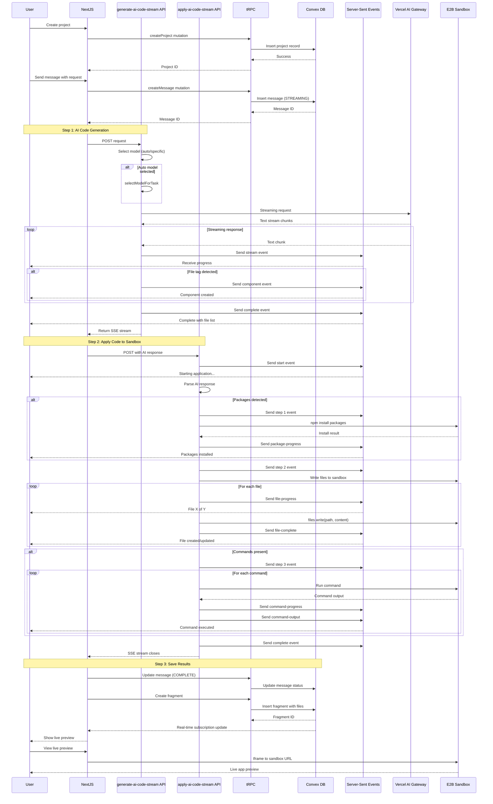
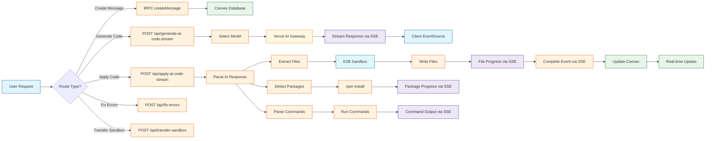

# ZapDev Architecture Overview

## System Components Diagram

```mermaid
graph TB
    subgraph "Client Layer"
        User[User Browser]
        NextJS[Next.js 15 App Router]
        React[React 19 Components]
        Tailwind[Tailwind CSS v4]
        Shadcn[Shadcn/UI Components]
        tRPCClient[tRPC Client]
        EventSource[EventSource / SSE Client]
    end

    subgraph "API Layer"
        NextJSRouter[Next.js API Routes]
        GenerateStream[generate-ai-code-stream]
        ApplyStream[apply-ai-code-stream]
        FixErrors[fix-errors]
        TransferSandbox[transfer-sandbox]
        ConvexClient[Convex Client]
    end

    subgraph "Authentication"
        StackAuth[Stack Auth]
        JWT[JWT Tokens]
    end

    subgraph "Database Layer"
        Convex[Convex Real-time Database]
        Projects[Projects Table]
        Messages[Messages Table]
        Fragments[Fragments Table]
        Usage[Usage Table]
        Subscriptions[Subscriptions Table]
        SandboxSessions[Sandbox Sessions]
    end

    subgraph "Streaming Layer"
        SSE[Server-Sent Events]
        SSEHelper[SSE Utilities]
        StreamingTypes[Streaming Types]
        AIProvider[AI Provider Manager]
    end

    subgraph "AI Layer"
        VercelGateway[Vercel AI Gateway]
        Claude[Anthropic Claude]
        OpenAI[OpenAI GPT]
        Gemini[Google Gemini]
        Qwen[Qwen]
        Grok[Grok]
    end

    subgraph "Sandbox Layer"
        E2B[E2B Code Interpreter]
        NextJS_Sandbox[Next.js Template]
        Angular_Sandbox[Angular Template]
        React_Sandbox[React Template]
        Vue_Sandbox[Vue Template]
        Svelte_Sandbox[Svelte Template]
    end

    subgraph "External Services"
        Figma[Figma API]
        GitHub[GitHub API]
        Polar[Polar Billing]
    end

    %% Client connections
    User --> NextJS
    NextJS --> React
    React --> Tailwind
    React --> Shadcn
    NextJS --> tRPCClient
    NextJS --> EventSource

    %% API Layer
    tRPCClient --> NextJSRouter
    EventSource --> NextJSRouter
    NextJSRouter --> GenerateStream
    NextJSRouter --> ApplyStream
    NextJSRouter --> FixErrors
    NextJSRouter --> TransferSandbox
    NextJSRouter --> ConvexClient

    %% Authentication
    StackAuth --> JWT
    NextJS --> StackAuth
    tRPCClient --> JWT

    %% Database Layer
    ConvexClient --> Convex
    Convex --> Projects
    Convex --> Messages
    Convex --> Fragments
    Convex --> Usage
    Convex --> Subscriptions
    Convex --> SandboxSessions

    %% Streaming Layer
    GenerateStream --> SSE
    ApplyStream --> SSE
    SSE --> SSEHelper
    SSE --> StreamingTypes
    GenerateStream --> AIProvider

    %% AI Layer
    AIProvider --> VercelGateway
    VercelGateway --> Claude
    VercelGateway --> OpenAI
    VercelGateway --> Gemini
    VercelGateway --> Qwen
    VercelGateway --> Grok

    %% Sandbox Layer
    ApplyStream --> E2B
    E2B --> NextJS_Sandbox
    E2B --> Angular_Sandbox
    E2B --> React_Sandbox
    E2B --> Vue_Sandbox
    E2B --> Svelte_Sandbox

    %% External Services
    NextJSRouter --> Figma
    NextJSRouter --> GitHub
    NextJSRouter --> Polar

    %% Real-time subscriptions
    Convex -.-> NextJS

    classDef client fill:#e1f5ff,stroke:#01579b
    classDef api fill:#fff3e0,stroke:#e65100
    classDef auth fill:#f3e5f5,stroke:#7b1fa2
    classDef db fill:#e8f5e9,stroke:#1b5e20
    classDef stream fill:#ede7f6,stroke:#4527a0
    classDef ai fill:#fff8e1,stroke:#f57f17
    classDef sandbox fill:#e0f7fa,stroke:#006064
    classDef external fill:#f5f5f5,stroke:#616161

    class User,NextJS,React,Tailwind,Shadcn,tRPCClient,EventSource client
    class NextJSRouter,GenerateStream,ApplyStream,FixErrors,TransferSandbox,ConvexClient api
    class StackAuth,JWT auth
    class Convex,Projects,Messages,Fragments,Usage,Subscriptions,SandboxSessions db
    class SSE,SSEHelper,StreamingTypes,AIProvider stream
    class VercelGateway,Claude,OpenAI,Gemini,Qwen,Grok ai
    class E2B,NextJS_Sandbox,Angular_Sandbox,React_Sandbox,Vue_Sandbox,Svelte_Sandbox sandbox
    class Figma,GitHub,Polar external
```



## Data Flow Diagram



## Component Relationships

```mermaid
erDiagram
    PROJECTS ||--o{ MESSAGES : has
    PROJECTS ||--o{ FRAGMENTS : has
    PROJECTS ||--o{ FRAGMENT_DRAFTS : has
    PROJECTS ||--o{ SANDBOX_SESSIONS : has
    PROJECTS ||--o{ ATTACHMENTS : has

    MESSAGES ||--|| FRAGMENTS : produces
    MESSAGES ||--o{ ATTACHMENTS : has

    ATTACHMENTS ||--o| IMPORTS : references

    USERS ||--o{ PROJECTS : owns
    USERS ||--o{ MESSAGES : sends
    USERS ||--o{ USAGE : has
    USERS ||--o{ SUBSCRIPTIONS : has
    USERS ||--o{ OAUTH_CONNECTIONS : has
    USERS ||--o{ SANDBOX_SESSIONS : owns
    USERS ||--o{ IMPORTS : initiates

    PROJECTS {
        string userId
        string name
        frameworkEnum framework
        string modelPreference
        number createdAt
        number updatedAt
    }

    MESSAGES {
        string content
        messageRoleEnum role
        messageTypeEnum type
        messageStatusEnum status
        id projectId
        number createdAt
        number updatedAt
    }

    FRAGMENTS {
        id messageId
        string sandboxId
        string sandboxUrl
        string title
        json files
        json metadata
        frameworkEnum framework
        number createdAt
        number updatedAt
    }

    FRAGMENT_DRAFTS {
        id projectId
        string sandboxId
        string sandboxUrl
        json files
        frameworkEnum framework
        number createdAt
        number updatedAt
    }

    ATTACHMENTS {
        attachmentTypeEnum type
        string url
        optional number width
        optional number height
        number size
        id messageId
        optional id importId
        optional json sourceMetadata
        number createdAt
        number updatedAt
    }

    OAUTH_CONNECTIONS {
        string userId
        oauthProviderEnum provider
        string accessToken
        optional string refreshToken
        optional number expiresAt
        string scope
        optional json metadata
        number createdAt
        number updatedAt
    }

    IMPORTS {
        string userId
        id projectId
        optional id messageId
        importSourceEnum source
        string sourceId
        string sourceName
        string sourceUrl
        importStatusEnum status
        optional json metadata
        optional string error
        number createdAt
        number updatedAt
    }

    USAGE {
        string userId
        number points
        optional number expire
        optional union planType
    }

    SUBSCRIPTIONS {
        string userId
        string clerkSubscriptionId
        string planId
        string planName
        union status
        number currentPeriodStart
        number currentPeriodEnd
        boolean cancelAtPeriodEnd
        optional array features
        optional json metadata
        number createdAt
        number updatedAt
    }

    SANDBOX_SESSIONS {
        string sandboxId
        id projectId
        string userId
        frameworkEnum framework
        sandboxStateEnum state
        number lastActivity
        number autoPauseTimeout
        optional number pausedAt
        number createdAt
        number updatedAt
    }
```

## API Route Flow


