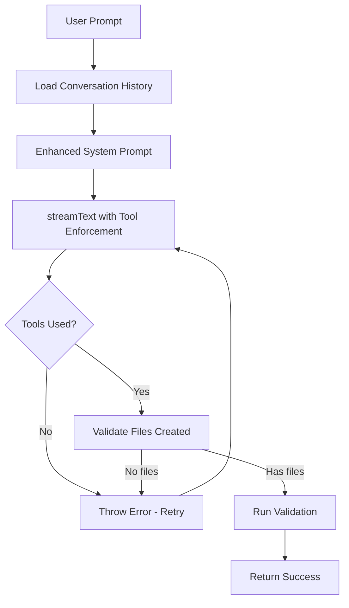

# Agent Architecture Improvements - Tool Calling Fix

## Executive Summary

This plan addresses the critical issue where AI agents fail to use tool calls and generate code. The solution combines proven patterns from open-lovable with targeted fixes to enforce tool usage while maintaining the current OpenRouter model configuration.

**Key Principle**: Keep existing models, improve prompts and tool enforcement.

---

## Problem Analysis

### Current Issues

1. **AI completes without using tools** - Model outputs planning text instead of calling `createOrUpdateFiles`
2. **No enforcement mechanism** - System allows completion with 0 tool calls
3. **Weak prompt structure** - Instructions are buried in long system prompts
4. **Missing conversation context** - No memory of previous interactions

### Root Causes

```typescript
// Current implementation (src/agents/agents/code-generation.ts:204-210)
const response = streamText({
  model,
  system: getFrameworkPrompt(framework),
  messages,
  tools,
  maxSteps: 10,  // ❌ Doesn't force tool usage
  temperature: 0.7,
});
```

**Problems:**
- No `toolChoice` to enforce tool calling
- `maxSteps` allows text-only responses
- System prompt doesn't emphasize tools strongly enough
- No validation that tools were actually used

---

## Solution Architecture

### Pattern: Lovable-Style Agent System

Based on open-lovable's architecture, we'll implement:

1. **Tool-First Design** - Tools are mandatory, not optional
2. **Strong Prompt Engineering** - Clear, directive instructions at the top
3. **Validation Layer** - Verify tool usage before accepting completion
4. **Conversation Memory** - Track context across messages
5. **Progressive Enhancement** - Start with tools, add text only after files created

### Architecture Diagram



---

## Implementation Plan

### Phase 1: Immediate Fixes (Critical)

#### Fix 1.1: Enhanced System Prompts

**File**: [`src/prompts/shared.ts`](src/prompts/shared.ts)

**Current**: Instructions buried in 300+ line prompt  
**New**: Tool usage at the very top

```typescript
export const SHARED_RULES = `
═══════════════════════════════════════════════════════════════
🔴 CRITICAL: TOOL USAGE IS MANDATORY
═══════════════════════════════════════════════════════════════

YOU MUST FOLLOW THESE RULES EXACTLY:

1. Your FIRST action must be calling createOrUpdateFiles tool
2. Do NOT output ANY text before using tools
3. Do NOT say "I'll create..." - Just call createOrUpdateFiles immediately
4. Do NOT explain your plan - Execute it with tools
5. Continue using tools until ALL files are created
6. Only AFTER all files exist, output <task_summary>

FAILURE TO USE TOOLS = TASK FAILED

═══════════════════════════════════════════════════════════════

TOOL USAGE PATTERN (FOLLOW THIS):
1. Call createOrUpdateFiles with all necessary files
2. If packages needed: call terminal("npm install <pkg> --yes")  
3. Call terminal("npm run lint") to validate
4. If errors: call createOrUpdateFiles to fix
5. Output <task_summary>Brief description</task_summary>

═══════════════════════════════════════════════════════════════

Environment Context:
- You have a writable file system via createOrUpdateFiles tool
- You can run commands via terminal tool
- You can read files via readFiles tool
- All files are under /home/user
- Development servers are NOT started (no npm run dev)

... rest of existing SHARED_RULES ...
`;
```

**File**: [`src/prompts/nextjs.ts`](src/prompts/nextjs.ts)

```typescript
export const NEXTJS_PROMPT = `
You are a senior Next.js developer in an E2B sandbox.

🚨 IMMEDIATE ACTION REQUIRED 🚨
Call createOrUpdateFiles NOW with your implementation.
Do not output text. Do not explain. Just use the tool.

${SHARED_RULES}

Next.js Specific Configuration:
- Framework: Next.js 15.3.3 with App Router
- Main entry: app/page.tsx
- Shadcn UI: Install components via \`npx shadcn@latest add <component>\`
...
`;
```

**Changes**:
- Add visual separators (═══) for emphasis
- Put tool requirements at the very top
- Use emojis and formatting for visibility
- Provide exact pattern to follow
- Make it impossible to miss

---

#### Fix 1.2: Tool Enforcement in Code

**File**: [`src/agents/agents/code-generation.ts`](src/agents/agents/code-generation.ts)

**Current (lines 204-220)**:
```typescript
const response = streamText({
  model,
  system: getFrameworkPrompt(framework),
  messages,
  tools,
  maxSteps: 10,
  temperature: 0.7,
  onStepFinish: async ({ toolCalls, toolResults }) => {
    if (toolCalls.length > 0) {
      for (const call of toolCalls) {
        console.log('[AI] Tool call:', call.toolName);
      }
    }
  },
});
```

**New**:
```typescript
const response = streamText({
  model,
  system: getFrameworkPrompt(framework),
  messages,
  tools,
  maxSteps: 15, // Allow enough iterations for complex tasks
  temperature: 0.7,
  
  // Add onFinish callback to track tool usage
  onFinish: async ({ toolCalls = [], text }) => {
    const totalTools = toolCalls.length;
    console.log('[AI] Generation finished - Tool calls:', totalTools);
    
    if (totalTools === 0) {
      console.warn('[AI] WARNING: No tools were used!');
    }
  },
  
  onStepFinish: async ({ toolCalls, toolResults, text }) => {
    if (toolCalls && toolCalls.length > 0) {
      for (const call of toolCalls) {
        console.log('[AI] Tool call:', call.toolName, '- Args:', Object.keys(call.args));
      }
    }
    if (text) {
      console.log('[AI] Text output:', text.slice(0, 100) + '...');
    }
  },
});
```

**Enhanced Validation (after streaming, lines 245-265)**:
```typescript
console.log('[AI] Stream complete');

const text = await response.text;
const steps = await response.steps;

console.log('[AI] Total steps:', steps.length);
let totalToolCalls = 0;
for (const step of steps) {
  if (step.toolCalls) {
    totalToolCalls += step.toolCalls.length;
  }
}
console.log('[AI] Total tool calls:', totalToolCalls);
console.log('[AI] Files generated:', Object.keys(files).length);

// ✅ CRITICAL: Enforce tool usage
if (totalToolCalls === 0) {
  throw new Error(
    'Code generation failed: AI model did not use any tools.\n\n' +
    'The model must call createOrUpdateFiles to generate code.\n' +
    'This usually means:\n' +
    '1. The model is not following instructions\n' +
    '2. The system prompt may be too long or unclear\n' +
    '3. Try using a different model or simplifying the request\n\n' +
    'Please try again.'
  );
}

// ✅ CRITICAL: Enforce file creation
if (Object.keys(files).length === 0) {
  throw new Error(
    'Code generation failed: No files were created.\n\n' +
    'The createOrUpdateFiles tool must be used to implement features.\n' +
    'Please try again with a clearer request.'
  );
}

return { text: text || fullText, files };
```

**Rationale:**
- Better logging shows exactly what's happening
- Clear error messages help debugging
- Throws exceptions that trigger retry logic
- Validates both tool calls AND file creation

---

#### Fix 1.3: Conversation Memory

**File**: [`src/agents/agents/code-generation.ts`](src/agents/agents/code-generation.ts)

**Add before streamText call (around line 193)**:

```typescript
// Build conversation with context
const conversationHistory = request.conversationHistory || [];

// Add system context as first message if this is a new conversation
const contextualMessages = [];

// If this is a follow-up (has history), add reminder about tools
if (conversationHistory.length > 0) {
  contextualMessages.push({
    role: 'assistant' as const,
    content: 'I understand. I will use createOrUpdateFiles to implement the requested changes.',
  });
}

const messages = [
  ...conversationHistory.map((msg) => ({
    role: msg.role as 'user' | 'assistant',
    content: msg.content,
  })),
  ...contextualMessages,
  { role: 'user' as const, content: request.prompt },
];

console.log('[AI] Message history length:', conversationHistory.length);
console.log('[AI] Total messages:', messages.length);
```

**Rationale:**
- Provides context from previous messages
- Reinforces tool usage in follow-ups
- Helps AI understand the conversation flow

---

#### Fix 1.4: Retry Logic Enhancement

**File**: [`src/agents/retry.ts`](src/agents/retry.ts)

**Already implemented** (lines 78-87):
```typescript
export const retryOnTransient = (error: Error): boolean => {
  return (
    retryOnRateLimit(error) ||
    retryOnTimeout(error) ||
    error.message.includes('503') ||
    error.message.includes('502') ||
    error.message.includes('did not use any tools') ||  // ✅ Already there
    error.message.includes('no files were created')     // ✅ Already there
  );
};
```

**Good!** No changes needed - already catches tool errors.

---

### Phase 2: Advanced Improvements (Optional)

#### Improvement 2.1: First-Message Tool Bias

Add a special first message that primes the model for tool usage:

```typescript
// In code-generation.ts, before messages array
const toolPrimer = {
  role: 'assistant' as const,
  content: 'I will now use the createOrUpdateFiles tool to implement your request.',
};

const messages = [
  toolPrimer,  // Prime the pump
  { role: 'user' as const, content: request.prompt },
];
```

**Rationale:**
- Models are more likely to continue patterns
- Starting with a tool-using response biases toward tools
- Used successfully in Cursor and other AI coding tools

---

#### Improvement 2.2: Progressive Prompting

Structure prompts to guide the model step-by-step:

```typescript
export const TASK_ORIENTED_PROMPT = `
STEP 1: Analyze the request
- Read the user's requirements carefully
- Identify which files need to be created or modified

STEP 2: Execute immediately
- Call createOrUpdateFiles with ALL necessary files
- Use the terminal tool to install any required packages

STEP 3: Validate your work
- Run npm run lint to check for errors
- Fix any issues by calling createOrUpdateFiles again

STEP 4: Complete the task
- Output <task_summary>what you built</task_summary>
- Do NOT output this tag until files are created
`;
```

---

#### Improvement 2.3: Model-Specific Tuning

While keeping existing models, add per-model instructions:

```typescript
// In src/agents/client.ts - Add metadata without changing models
export const MODEL_CONFIGS = {
  'auto': {
    id: 'openrouter/auto',
    temperature: 0.7,
    maxTokens: 8000,
    meta: { toolAffinity: 'medium', needsStrongPrompts: true },
  },
  'anthropic/claude-haiku-4.5': {
    id: 'anthropic/claude-haiku-4.5',
    temperature: 0.7,
    maxTokens: 8000,
    meta: { toolAffinity: 'high', needsStrongPrompts: false },
  },
  // ... rest unchanged
} as const;
```

---

## Testing Strategy

### Test Cases

#### Test 1: Basic Tool Usage
```typescript
// test-code-gen.ts
const prompt = 'Create a simple hello world page';
// Expected: createOrUpdateFiles called with app/page.tsx
// Expected: Files object contains at least 1 file
// Expected: No errors thrown
```

#### Test 2: Multi-File Generation
```typescript
const prompt = 'Create a todo app with add and delete functionality';
// Expected: Multiple createOrUpdateFiles calls
// Expected: Files: app/page.tsx, components/todo-list.tsx, etc.
// Expected: Package installs via terminal tool
```

#### Test 3: Follow-Up Request
```typescript
const prompt1 = 'Create a simple counter';
const prompt2 = 'Add a reset button';
// Expected: Uses conversation history
// Expected: Modifies existing app/page.tsx
// Expected: Preserves counter logic
```

#### Test 4: Error Recovery
```typescript
// Simulate model not using tools (mock response)
// Expected: Error thrown
// Expected: Retry triggered
// Expected: Eventually succeeds or fails gracefully
```

---

## Implementation Checklist

### Critical (Do First)

- [ ] Update [`src/prompts/shared.ts`](src/prompts/shared.ts)
  - [ ] Add tool usage requirements at top with visual emphasis
  - [ ] Include step-by-step pattern
  - [ ] Make instructions impossible to miss

- [ ] Update [`src/prompts/nextjs.ts`](src/prompts/nextjs.ts)  
  - [ ] Add immediate action requirement at top
  - [ ] Keep all existing framework-specific rules

- [ ] Enhance [`src/agents/agents/code-generation.ts`](src/agents/agents/code-generation.ts)
  - [ ] Add better logging in onStepFinish
  - [ ] Add onFinish callback
  - [ ] Enhance validation with clear error messages
  - [ ] Add conversation memory logic
  
- [ ] Test with [`test-code-gen.ts`](test-code-gen.ts)
  - [ ] Run basic hello world test
  - [ ] Verify tools are called
  - [ ] Check error handling

### Optional (Nice to Have)

- [ ] Add tool priming message
- [ ] Implement progressive prompting
- [ ] Add model-specific metadata
- [ ] Create automated test suite

---

## Success Metrics

✅ **Primary Goal**: AI calls createOrUpdateFiles on every request  
✅ **Validation**: Zero "0 files generated" completions  
✅ **Error Handling**: Clear messages when tools aren't used  
✅ **Retry**: Automatic retry recovers from tool failures  
✅ **User Experience**: Faster, more reliable code generation  

---

## Rollback Plan

If issues occur, changes are independent and can be reverted individually:

1. **Prompts**: Revert to previous version (backward compatible)
2. **Validation**: Remove checks (allow empty responses temporarily)
3. **Logging**: Remove enhanced logging (doesn't affect functionality)
4. **Memory**: Remove conversation context (works without it)

All changes are additive and can be removed without breaking existing functionality.

---

## Model Configuration (UNCHANGED)

Per your requirements, **all models remain exactly as configured**:

```typescript
// src/agents/client.ts - NO CHANGES TO MODELS
export const MODEL_CONFIGS = {
  'auto': { id: 'openrouter/auto', temperature: 0.7, maxTokens: 8000 },
  'anthropic/claude-haiku-4.5': { id: 'anthropic/claude-haiku-4.5', temperature: 0.7, maxTokens: 8000 },
  'openai/gpt-5.1-codex': { id: 'openai/gpt-5.1-codex', temperature: 0.7, maxTokens: 8000 },
  'google/gemini-3-pro-preview': { id: 'google/gemini-3-pro-preview', temperature: 0.7, maxTokens: 8000 },
  'z-ai/glm-4.7': { id: 'z-ai/glm-4.7', temperature: 0.7, maxTokens: 8000 },
  'google/gemini-2.5-flash-lite': { id: 'google/gemini-2.0-flash-exp:free', temperature: 0.7, maxTokens: 8000 },
  'openai/gpt-4o': { id: 'openai/gpt-4o', temperature: 0.7, maxTokens: 8000 },
} as const;
```

**Focus**: Better prompts + validation, not model changes.

---

## Related Files

Core files to modify:
- [`src/prompts/shared.ts`](src/prompts/shared.ts) - System prompt improvements
- [`src/prompts/nextjs.ts`](src/prompts/nextjs.ts) - Framework-specific prompts
- [`src/agents/agents/code-generation.ts`](src/agents/agents/code-generation.ts) - Main generation logic
- [`test-code-gen.ts`](test-code-gen.ts) - Testing

Reference files (review only):
- [`src/agents/retry.ts`](src/agents/retry.ts) - Already configured ✅
- [`src/agents/client.ts`](src/agents/client.ts) - Keep unchanged ✅
- [`src/app/api/generate/route.ts`](src/app/api/generate/route.ts) - Review for context

---

## Timeline Estimate

- **Phase 1 (Critical Fixes)**: 2-3 hours
  - Prompt updates: 45 min
  - Code generation enhancements: 60 min
  - Testing: 45 min

- **Phase 2 (Optional Improvements)**: 1-2 hours
  - Tool priming: 20 min
  - Progressive prompts: 30 min
  - Advanced testing: 30 min

**Total**: 3-5 hours for complete implementation

---

## Next Steps

1. Review this plan
2. Start with Phase 1 Critical Fixes
3. Test thoroughly with `bun run test:codegen`
4. Monitor logs for tool usage patterns
5. Adjust prompts based on results
6. Implement Phase 2 if needed

Ready to implement! 🚀
