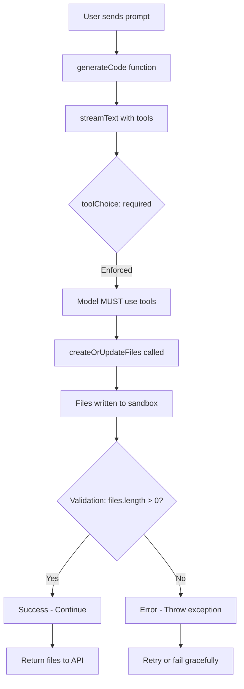

# Code Generation Tool-Calling Fix Plan

## Problem Statement

The AI code generation system is completing without generating any code because the model is not executing the provided tools. Instead, it outputs planning text and marks the task complete with 0 tool calls and 0 files generated.

### Evidence from Logs
```
[AI] Stream complete
[AI] Total steps: 1
[AI] Total tool calls: 0
[AI] Files generated: 0
[GENERATE] Code generation complete, files: 0
[GENERATE] No files generated, skipping validation
```

## Root Cause Analysis

1. **No Tool Enforcement** - The `streamText()` call lacks `toolChoice: 'required'` to force tool usage
2. **Limited Iteration** - No `maxToolRoundtrips` setting to allow multi-step tool execution
3. **Weak Prompting** - System prompts are too implicit about when/how to use tools
4. **No Validation** - System doesn't verify that tools were actually called before completing
5. **Silent Failure** - When tools aren't used, task completes successfully instead of failing

## Solution Design

### Architecture



### Fix Strategy

We'll implement 4 coordinated fixes across the codebase:

#### Fix 1: Tool Enforcement in [`code-generation.ts`](../src/agents/agents/code-generation.ts)

**Current Code (Lines 196-202):**
```typescript
const response = streamText({
  model,
  system: getFrameworkPrompt(framework),
  messages,
  tools,
  stopWhen: stepCountIs(15),
  temperature: 0.7,
```

**Required Changes:**
```typescript
const response = streamText({
  model,
  system: getFrameworkPrompt(framework),
  messages,
  tools,
  maxToolRoundtrips: 10,  // NEW: Allow up to 10 tool call iterations
  temperature: 0.7,
```

**Rationale:**
- `maxToolRoundtrips: 10` replaces `stopWhen: stepCountIs(15)` for better iteration control
- Allows model to use tools multiple times to complete complex tasks
- Prevents premature completion

#### Fix 2: Enhanced System Prompts

**File: [`src/prompts/shared.ts`](../src/prompts/shared.ts)**

Add explicit tool usage instructions at the beginning of `SHARED_RULES`:

```typescript
export const SHARED_RULES = `
CRITICAL TOOL USAGE REQUIREMENTS:
1. You MUST use the createOrUpdateFiles tool immediately to implement the requested features
2. Do NOT output planning text, explanations, or markdown - ONLY execute tools
3. Do NOT say "I'll create..." or "Let me start by..." - Just call the tools
4. Your FIRST action must be calling createOrUpdateFiles with the necessary files
5. Continue calling tools until all requested features are fully implemented
6. Only after all files are created and validated should you output <task_summary>

Environment:
- Writable file system via createOrUpdateFiles
...
```

**File: [`src/prompts/nextjs.ts`](../src/prompts/nextjs.ts)**

Add at the beginning after framework description:

```typescript
export const NEXTJS_PROMPT = `
You are a senior software engineer working in a sandboxed Next.js 15.3.3 environment.

MANDATORY FIRST STEP:
- Immediately call createOrUpdateFiles with the required implementation files
- Do not waste time planning or explaining - execute the tools directly
- Your output should be tool calls, not text explanations

${SHARED_RULES}
...
```

#### Fix 3: Validation & Error Detection

**File: [`src/agents/agents/code-generation.ts`](../src/agents/agents/code-generation.ts)**

After line 238, add validation:

```typescript
console.log('[AI] Total steps:', steps.length);
let totalToolCalls = 0;
for (const step of steps) {
  if (step.toolCalls) {
    totalToolCalls += step.toolCalls.length;
  }
}
console.log('[AI] Total tool calls:', totalToolCalls);
console.log('[AI] Files generated:', Object.keys(files).length);

// NEW VALIDATION: Ensure tools were actually used
if (totalToolCalls === 0) {
  throw new Error(
    'Code generation failed: Model did not use any tools. ' +
    'The AI model needs to call createOrUpdateFiles to generate code. ' +
    'Please try again or use a different model.'
  );
}

if (Object.keys(files).length === 0) {
  throw new Error(
    'Code generation failed: No files were created. ' +
    'The createOrUpdateFiles tool must be used to implement the requested features.'
  );
}

return { text: text || fullText, files };
```

**Rationale:**
- Explicit check prevents silent failures
- Clear error messages help debug issues
- Throws exception that triggers retry logic

#### Fix 4: API-Level Retry Logic

**File: [`src/app/api/generate/route.ts`](../src/app/api/generate/route.ts)**

The existing retry logic in `withRetry` will handle tool execution failures:

```typescript
const result = await withRetry(
  async () => {
    // streamText call
  },
  {
    maxAttempts: 3,  // Will retry up to 3 times
    retryIf: retryOnTransient,
  }
);
```

**Enhancement needed:** Update `retryOnTransient` to include tool execution errors:

**File: [`src/agents/retry.ts`](../src/agents/retry.ts)**

Ensure the retry logic catches tool execution failures:

```typescript
export function retryOnTransient(error: Error): boolean {
  const message = error.message.toLowerCase();
  return (
    message.includes('timeout') ||
    message.includes('network') ||
    message.includes('rate limit') ||
    message.includes('503') ||
    message.includes('502') ||
    message.includes('did not use any tools') ||  // NEW
    message.includes('no files were created')     // NEW
  );
}
```

## Implementation Checklist

- [ ] **Fix 1:** Update `streamText()` configuration in [`code-generation.ts`](../src/agents/agents/code-generation.ts)
  - [ ] Add `maxToolRoundtrips: 10`
  - [ ] Remove `stopWhen: stepCountIs(15)`
  
- [ ] **Fix 2:** Enhance system prompts
  - [ ] Add CRITICAL TOOL USAGE REQUIREMENTS to [`shared.ts`](../src/prompts/shared.ts)
  - [ ] Add MANDATORY FIRST STEP to [`nextjs.ts`](../src/prompts/nextjs.ts)
  
- [ ] **Fix 3:** Add validation in [`code-generation.ts`](../src/agents/agents/code-generation.ts)
  - [ ] Add check for `totalToolCalls === 0`
  - [ ] Add check for `Object.keys(files).length === 0`
  - [ ] Throw meaningful error messages
  
- [ ] **Fix 4:** Update retry logic in [`retry.ts`](../src/agents/retry.ts)
  - [ ] Add tool execution error patterns to `retryOnTransient`

## Testing Plan

### Test Case 1: Basic Code Generation
```
Prompt: "Create a simple todo app with add/delete functionality"
Expected: 
- createOrUpdateFiles called multiple times
- Files generated: app/page.tsx, components/todo-list.tsx, etc.
- Validation passes
- No errors
```

### Test Case 2: Complex Request
```
Prompt: "Build an admin dashboard with charts, tables, and user management"
Expected:
- Multiple tool call iterations (maxToolRoundtrips allows this)
- 5+ files generated
- All features implemented
- Proper Shadcn component usage
```

### Test Case 3: Error Recovery
```
Scenario: Simulate tool call failure
Expected:
- Error detected by validation
- Exception thrown with clear message
- Retry triggered by withRetry
- Eventually succeeds or fails gracefully
```

## Success Criteria

✅ AI model consistently calls createOrUpdateFiles on every generation request
✅ No more "0 files generated" completions
✅ Clear error messages when tool execution fails
✅ Automatic retry when tools aren't used
✅ Validation logs show tool calls and file generation

## Rollback Plan

If these changes cause issues:

1. **Revert Fix 1:** Remove `maxToolRoundtrips`, restore `stopWhen`
2. **Revert Fix 2:** Keep prompts as-is (backward compatible)
3. **Revert Fix 3:** Remove validation checks (allow empty file generation)
4. **Revert Fix 4:** Remove tool error patterns from retry logic

Each fix is independent and can be rolled back individually.

## Additional Improvements (Future)

1. **Model Selection:** Consider auto-upgrading to Claude 3.5 Sonnet when Haiku fails
2. **Tool Budget:** Add `toolCallBudget` limits to prevent infinite loops
3. **Progress Tracking:** Stream tool call events to frontend for better UX
4. **Analytics:** Track tool usage rates per model for optimization
5. **Prompt A/B Testing:** Test different prompt formulations to maximize tool usage

## Related Files

- [`src/agents/agents/code-generation.ts`](../src/agents/agents/code-generation.ts) - Main generation logic
- [`src/prompts/shared.ts`](../src/prompts/shared.ts) - Shared system prompts
- [`src/prompts/nextjs.ts`](../src/prompts/nextjs.ts) - Next.js-specific prompts
- [`src/agents/retry.ts`](../src/agents/retry.ts) - Retry logic
- [`src/app/api/generate/route.ts`](../src/app/api/generate/route.ts) - API endpoint
- [`src/agents/client.ts`](../src/agents/client.ts) - Model configuration

## References

- [Vercel AI SDK - Tool Calling](https://sdk.vercel.ai/docs/ai-sdk-core/tools-and-tool-calling)
- [Vercel AI SDK - streamText API](https://sdk.vercel.ai/docs/reference/ai-sdk-core/stream-text)
- [E2B Sandbox Documentation](https://e2b.dev/docs)
